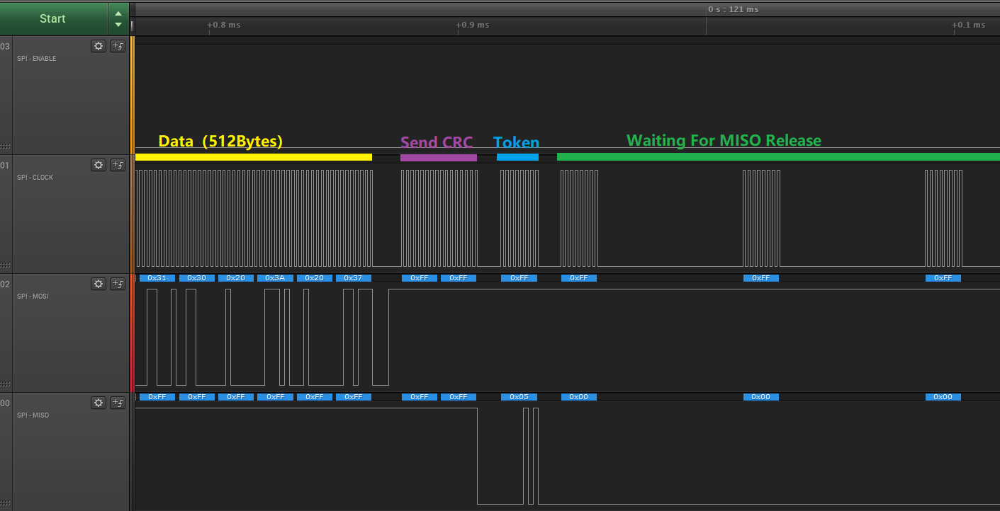

# Spi SdCard 快速入门
## 0.说明
统一整理下 Spi sdcard 协议内容。

## 1.种类
卡有几种，通过外表是分不出来是哪一种的，通过容量也只能大概分出来。  
1.V1  
2.V2SC  
3.V2HC  
4.SDXC  
5.SDUC  

他们各个的协议是不相同的，初始化的时候可以识别V1/V2SC/V2HC。  
这里的代码不支持SDXC和SDUC，不知道是否支持SPI，直接使用的话，容量和返回值也不正确。  
8G以上的卡，基本不能用。  
8G的卡，有些能用。  
8G以下的卡，基本都能用。  


## 2.结构


## 3.CMD
### 格式
```
6 bytes (CMD | 0x40 + arg1 + arg2 + arg3 + arg4 + crc7 | 0x01)
```
```
CMD0 (hex) : 40 00 00 00 00 95
CMD55 (hex): 77 00 00 00 00 00
```


ACMD ：相当于二级命令，凡是ACMD前面先发CMD55，先发CMD55进入二级命令，再发CMD41，连起来用就行了。  
例如：ACMD41 = CMD55 + CMD41.   

主要命令：CMD0, CMD8, (CMD55, ACMD41), CMD58, CMD9.  

### 响应:
命令响应类型有：R1,R1b,R2,R3,R7。    
每种命令都有对应的响应解析,而且数据长度不一样。    
基本了解R1即可。    
命令的type无视即可。    

<!--  -->


### 基本操作
如图先发 6 bytes CMD55，然后一直发0XFF等待回复，一般发到第二个0xFF就会收到回复。    
前后的 0XFF 多余的，可以不发。  


CMD55 = 0X37 | 0x40 = 55 | 0x40    
response=0x01: 0x01 不是代表 R1，而是这个response要参考 R1 的解释。 （0x01=没有错误，且目前是In idle state）   

CMD0: 
``` 
MOSI: 40 00 00 00 00 95 (FF FF)
MISO:                    FF 01
```

CMD8: CMD8的response是R7(5 bytes)，比较特殊，照抄即可。
``` 
MOSI: 48 00 00 01 AA 87 ( FF FF FF FF FF FF )
MISO:                     FF 01 00 00 01 AA 
```


## 4.REG
SPI有6个寄存器，主要是CSD需要看一下，其他无视即可，CSD通过CMD9获取，可以计算卡的容量，CSD的含义有V1 V2 V3版本。 各版本计算容量的方式都不一样。V3版本的卡读取错误(可能是不支持SPI模式).
## 5.Hardware
## 6.Init

建议下载逻辑分析记录看看。
```c
uint8_t spiSdInit(){
	uint8_t r1 = 0;

	giikerSpiInitSdcard();
	spiSdSendReset512();
	spiSdSendReset74();

    GPIO_LOW(PIN_SD_CS);

    r1 = spiSdSendCmd(CMD0, 0, 0x95);
    if(r1 != 0x01){
		print("cmd0 Err. r1=%x", r1);
        GPIO_HIGH(PIN_SD_CS);
    	return 1;
    }

    r1 = spiSdSendCmd8();
    r1 &= 0xfe;

	if (r1 == 0x00) {//sd2.0
		print("SD_TYPE_V2.0");

		/**
		 * 8G SDHC Power on reset: 800ms
		 */
		for (uint16_t i = 0; i < 2800; i++) {
			r1 = spiSdSendCmd(CMD55, 0, 0);
			r1 = spiSdSendCmd(ACMD41, 0x40000000, 1);
			if (r1 == 0x01) {
				SPI_SD_DELAY();
				continue;
			}else if(r1 == 0x00){
				print("i = %d", i);
				break;
			}else{
				print("acmd41 Err. r1 = %x", r1);
			    GPIO_HIGH(PIN_SD_CS);
				return 3;
			}
		}
		if (r1 == 0x01) {
			print("acmd41 Err. timeout");
		    GPIO_HIGH(PIN_SD_CS);
			return 3;
		}else{
			r1 = spiSdSendCmd58();
			if(rxBuff[0] & 0x40){//ccs
				print("SD_TYPE_V2HC");
				spiSdCardType = SD_TYPE_V2HC;
			}else{
				print("SD_TYPE_V2SC");
				spiSdCardType = SD_TYPE_V2SC;
			}
		}
	}else if(r1 & 0x04){//sd1.0
		print("SD_TYPE_V1");
		spiSdCardType = SD_TYPE_V1;

		r1 = spiSdSendCmd58();
		for (uint16_t i = 0; i < 2800; i++) {
			r1 = spiSdSendCmd(CMD55, 0, 0);
			r1 = spiSdSendCmd(ACMD41, 0, 0);
			if (r1 == 0x01) {
				SPI_SD_DELAY();
				continue;
			}else if(r1 == 0x00){
				break;
			}else{
				print("acmd41 Err. r1 = %x", r1);
			    GPIO_HIGH(PIN_SD_CS);
				return 3;
			}
		}

		if (r1 == 0x01) {
			print("acmd41 Err. timeout");
		    GPIO_HIGH(PIN_SD_CS);
			return 3;
		}else{
			r1 = spiSdSendCmd58();
		}

	}else{
		print("cmd8 Err. r1=%x", r1);
        GPIO_HIGH(PIN_SD_CS);
		return 2;
	}

    giikerSpiSdSpeedUp();
    print("****************** CID ******************");
    spiSdSendCmd10();
    print("****************** CSD ******************");
    spiSdSendCmd9();
    print("******************  ******************");
    GPIO_HIGH(PIN_SD_CS);
    return 0;
}
```


## 7.Read/Write
### Read:


```c

/**
 * 0x00: success
 */
uint8_t spiSdReadSingleBlock(uint32_t sec, uint8_t *data) {
	uint8_t r1;
    GPIO_LOW(PIN_SD_CS);

	if (spiSdCardType == SD_TYPE_V1 || spiSdCardType == SD_TYPE_V2SC) {
		sec <<= 9;
	}

	// send CMD17
	r1 = spiSdSendCmd(CMD17, sec, 0);

	// if response received from card
	if (r1 == 0x00) {

		/**
		 * wait for a response token (timeout = 100ms)
		 * V2SC: 0.8ms
		 * V2HC: 0.6ms
		 * V2HC power on reset: 10ms
		 */
		for(uint16_t i = 0; i < 500; i++){

			txBuff[0] = 0xff;
			rxBuff[0] = 0xff;
			spiSdSendBytes(txBuff, rxBuff, 1, 1);

			if (rxBuff[0] != 0xFF){
				break;
			}
			SPI_SD_DELAY();
		}

		if(rxBuff[0] == 0xff){
		    GPIO_HIGH(PIN_SD_CS);
			return SPI_SD_ERR_BUSY_TIMEOUT;
		}else if(rxBuff[0] == 0xfe){
		}else if(rxBuff[0] == 0xfc){
//		}else if(rxBuff[0] == 0xfd){//???
		}else{
		    GPIO_HIGH(PIN_SD_CS);
			return SPI_SD_ERR_TKN_INVALID;
		}

		spiSdSendBytes(txBuff, data, 0, 512);

		// read 16-bit CRC
		txBuff[0] = 0xff;
		txBuff[1] = 0xff;
		txBuff[2] = 0xff;
		spiSdSendBytes(txBuff, rxBuff, 3, 0);

	    GPIO_HIGH(PIN_SD_CS);
		return 0;
	}else{
	    GPIO_HIGH(PIN_SD_CS);
		return SpiSdErrR1(r1);
	}

}
```

### Write:



```c
/**
 *	0x00: success
 */
uint8_t spiSdWriteSingleBlock(uint32_t sec, const uint8_t *data) {
	uint8_t r1;
	uint8_t token;

    GPIO_LOW(PIN_SD_CS);

	if (spiSdCardType == SD_TYPE_V1 || spiSdCardType == SD_TYPE_V2SC) {
		sec <<= 9;
	}

	r1 = spiSdSendCmd(CMD24, sec, 0x00);

	if (r1 != 0x00) {
	    GPIO_HIGH(PIN_SD_CS);
		return SpiSdErrR1(r1);
	}

	//token
	txBuff[0] = 0xff;
	txBuff[1] = 0xff;
	txBuff[2] = 0xff;
	txBuff[3] = 0xfe;
	spiSdSendBytes(txBuff, rxBuff, 4, 4);

	//data
	spiSdSendBytes(data, rxBuff, 512, 0);

	//crc
	txBuff[0] = 0xff;
	txBuff[1] = 0xff;
	spiSdSendBytes(txBuff, rxBuff, 2, 0);

	//token
	txBuff[0] = 0xff;
	rxBuff[0] = 0xff;
	spiSdSendBytes(txBuff, rxBuff, 1, 1);

	//token
	token = rxBuff[0] & 0x1F;
//	if (token != 0x05 && token != 0x00) {
	if (token != 0x05) {
	    GPIO_HIGH(PIN_SD_CS);
		return SpiSdErrTokenWrite(rxBuff[0]);
	}

	/**
	 * V2SC: 2.9ms
	 * 8G V2HC: 2.12ms
	 * 512 V2SC: 174ms, 215ms
	 */
	for(uint16_t i = 0; i < 8000; i++){

		txBuff[0] = 0xff;
		rxBuff[0] = 0;
		spiSdSendBytes(txBuff, rxBuff, 1, 1);

		if(rxBuff[0] != 0x00){
		    GPIO_HIGH(PIN_SD_CS);
			return 0;
		}
		SPI_SD_DELAY();
	}

    GPIO_HIGH(PIN_SD_CS);
	return SPI_SD_ERR_BUSY_TIMEOUT;
}

```

## 8.FatFs 移植
FatFs 使程序支持FAT16/FAT32/exFAT文件系统的形式访问SD卡。

http://elm-chan.org/fsw/ff/00index_e.html
下载FatFs R0.14b 或者 最新版。

修改两个文件去移植：ffconf.h 和 diskio.c。总共4个地方，即可完成移植。

diskio.c：主要是读写要实现自己的spi sd卡 section的读写。
ffconf.h：主要是改一些配置，按自己需求也行。

### 1.diskio.c  disk_status/disk_initialize/disk_ioctl 3个函数内容全部删除，改成return 0;
disk_ioctl 需要实现一些命令响应(剩余容量之类的)，暂时不做了。
```c
DSTATUS disk_status (
	BYTE pdrv		/* Physical drive nmuber to identify the drive */
){
	return 0;
}
...
```
### 2.diskio.c 添加时间函数:
```c
DWORD get_fattime(void){
	return 0;
}
```

### 3.diskio.c 修改读写函数:
```c
DRESULT disk_read (
	BYTE pdrv,		/* Physical drive nmuber to identify the drive */
	BYTE *buff,		/* Data buffer to store read data */
	LBA_t sector,	/* Start sector in LBA */
	UINT count		/* Number of sectors to read */
){
//	print("................... disk_read sec:%x , %d", sector, count);
	uint8_t err = 0;
	for (uint32_t i = 0; i < count; i++) {
		err = spiSdReadSingleBlock(sector + i, buff + 512 * i);
		if(err != 0){
			print("disk_read err: %x , sec: %x", err, sector + i);
			return RES_ERROR;
		}
	}
	return RES_OK;
}

DRESULT disk_write (
	BYTE pdrv,			/* Physical drive nmuber to identify the drive */
	const BYTE *buff,	/* Data to be written */
	LBA_t sector,		/* Start sector in LBA */
	UINT count			/* Number of sectors to write */
){
//	print("................... disk_write sec:%x , %d", sector, count);
	uint8_t err = 0;
	for (uint32_t i = 0; i < count; i++) {
		err = spiSdWriteSingleBlock(sector + i, buff + 512 * i);
		if(err != 0){
			print("disk_write err: %x , sec: %x", err, sector + i);
			return RES_ERROR;
		}
	}
	return RES_OK;
}


```

### 4.ffconf.h: 87
改成不支持多国语言，也不支持中文，减少容量消耗。
要支持中文的改成936，容量会大100k以上。
```c
#define FF_CODE_PAGE	437 //932 line:87
```
支持printf操作，支持字符串操作。
```c
#define FF_USE_STRFUNC	1 //line:87
#define FF_STRF_ENCODE	1 //line:62
```
支持长文件名。
```c
#define FF_USE_LFN	1 //line:116
#define FF_MAX_LFN	100 //line:117
```

## 9.FatFs 使用
主要是文件列表，TXT文件读写。
```c
/******************** LS **********************/
char sizeString[10];

char* fileSizeString(FSIZE_t size){
	uint32_t sizeHigh;
	sizeHigh = size;
	if(sizeHigh >= (1 << 30)){
		sizeHigh = sizeHigh >> 20;
        sprintf(sizeString, "%d.%dGB", sizeHigh / 1000, sizeHigh % 1000 / 100);
	}else if(sizeHigh >= (1 << 20)){
		sizeHigh = sizeHigh >> 10;
        sprintf(sizeString, "%d.%dMB", sizeHigh / 1000, sizeHigh % 1000 / 100);
	}else if(sizeHigh >= (1 << 10)){
		sizeHigh = sizeHigh;
        sprintf(sizeString, "%d.%dKB", sizeHigh / 1000, sizeHigh % 1000 / 100);
	}else{
        sprintf(sizeString, "%d B", sizeHigh);
	}
	return sizeString;
}

FRESULT scan_files(char* path) {
    FRESULT res;
    DIR dir;
    UINT i;
    static FILINFO fno;

    res = f_opendir(&dir, path);                       /* Open the directory */
    if (res == FR_OK) {
        for (;;) {
            res = f_readdir(&dir, &fno);                   /* Read a directory item */
            if (res != FR_OK || fno.fname[0] == 0) {  /* Break on error or end of dir */
            	break;
            }
            if (fno.fattrib & AM_DIR) {                    /* It is a directory */
                i = strlen(path);

                sprintf(&path[i], "/%s", fno.fname);

                res = scan_files(path);                    /* Enter the directory */
                if (res != FR_OK) break;
                path[i] = 0;
            } else {                                       /* It is a file. */
                print("%s\t %s/%s", fileSizeString(fno.fsize), path, fno.fname);
            }
        }
        f_closedir(&dir);
    }

    return res;
}

void listFile(){
    FATFS fs;
    FRESULT res;
    char buff[256];
    res = f_mount(&fs, "", 1);
    if (res == FR_OK) {
        strcpy(buff, "/");
        res = scan_files(buff);
    }
}

/******************** Read **********************/

void fsReadTxt(char * name){
    FATFS  fs1;      /* Work area (filesystem object) for logical drives */
    FIL  fdst;      /* File objects */
    FRESULT fr;          /* FatFs function common result code */
    char line[82]; /* Line buffer */

    /* Give work areas to each logical drive */
    f_mount(&fs1, "", 1);

    /* Create destination file on the drive 0 */
    fr = f_open(&fdst, name, FA_READ);

    print("f_open: %x", fr);

    while (f_gets(line, sizeof line, &fdst)) {
		print(line);
	}

    f_close(&fdst);
}

/******************** Write **********************/

void fsWriteTxt(char * name){
    FATFS  fs1;      /* Work area (filesystem object) for logical drives */
    FIL  fdst;      /* File objects */
    FRESULT fr;          /* FatFs function common result code */

    /* Give work areas to each logical drive */
    fr = f_mount(&fs1, "", 1);
    print("f_mount: %x", fr);

    /* Create destination file on the drive 0 */
    fr = f_open(&fdst, name, FA_WRITE | FA_CREATE_ALWAYS);
    print("f_open: %x", fr);

    for (uint8_t i = 0; i < 20; i++) {
        fr = f_printf(&fdst, "%d : 888\r\n", i);
//        print("%d: f_printf: %x", i, fr);
    }

    fr = f_sync(&fdst);
    print("f_sync: %x", fr);
    fr = f_close(&fdst);
    print("f_close: %x", fr);
}

void fsAppendTxt(char * name){
    FATFS  fs1;      /* Work area (filesystem object) for logical drives */
    FIL  fdst;      /* File objects */
    FRESULT fr;          /* FatFs function common result code */

    /* Give work areas to each logical drive */
    f_mount(&fs1, "", 1);

    /* Create destination file on the drive 0 */
    fr = f_open(&fdst, name, FA_WRITE | FA_OPEN_APPEND);
    print("f_open: %x", fr);

    for (uint16_t i = 0; i < 30; i++) {
        fr = f_printf(&fdst, "%d : 666\r\n", i);
    }

    fr = f_sync(&fdst);
    print("f_sync: %x", fr);
    fr = f_close(&fdst);
    print("f_close: %x", fr);
}

void fileOp(){

    print("***************** LS *****************");
	listFile();

//    print("***************** Write *****************");
//	fsWriteTxt("0:6.txt");
//    print("***************** Append *****************");
//	fsAppendTxt("0:6.txt");
//
    print("***************** Read *****************");
	fsReadTxt("0:6.txt");

    print("***************** ok *****************");
}
```


## 10.Section/Block
512 bytes , 可以认为是一样的东西。


## 11.参考资料：
register：[http://xxxdk.xyz/xxx/2020/10/SD卡相关寄存器简介/](http://xxxdk.xyz/xxx/2020/10/SD%E5%8D%A1%E7%9B%B8%E5%85%B3%E5%AF%84%E5%AD%98%E5%99%A8%E7%AE%80%E4%BB%8B/)  
cmd：[http://xxxdk.xyz/xxx/2021/01/SD卡命令简介/](http://xxxdk.xyz/xxx/2021/01/SD%E5%8D%A1%E5%91%BD%E4%BB%A4%E7%AE%80%E4%BB%8B/)  
fat：[https://www.kancloud.cn/digest/stm32-peripheral/168569](https://www.kancloud.cn/digest/stm32-peripheral/168569)  
fat：[http://elm-chan.org/fsw/ff/00index_e.html](http://elm-chan.org/fsw/ff/00index_e.html)  
init：[http://xxxdk.xyz/xxx/2021/03/SD卡识别流程简介/](http://xxxdk.xyz/xxx/2021/03/SD%E5%8D%A1%E8%AF%86%E5%88%AB%E6%B5%81%E7%A8%8B%E7%AE%80%E4%BB%8B/)  
hardware/CMD：[http://chlazza.nfshost.com/sdcardinfo.html](http://chlazza.nfshost.com/sdcardinfo.html)  
code : [https://zhuanlan.zhihu.com/p/37691455](https://zhuanlan.zhihu.com/p/37691455)  

